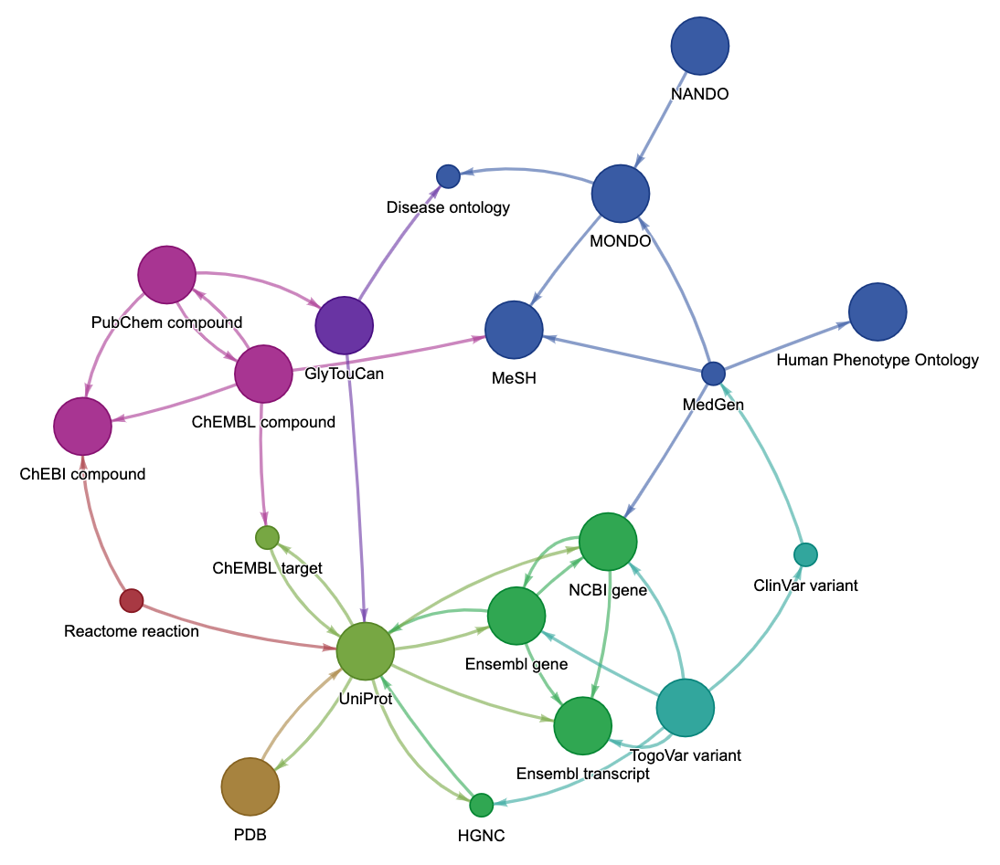
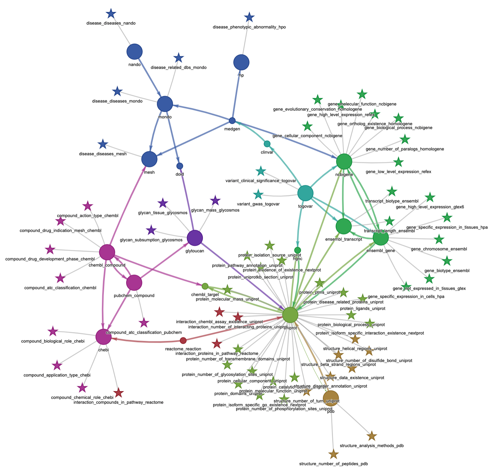

# TogoDX path

## v2022-11

ID links
* https://togodx.github.io/togodx-path/path-highlight-2022-11.html


ID links and  attributes
* https://togodx.github.io/togodx-path/path-attr-label-2022-11.html


Table of ID links
* https://github.com/togodx/togodx-path/blob/main/tsv/dataset-links-2022-11.tsv

Table of attributes
* https://github.com/togodx/togodx-path/blob/main/tsv/attribute-description-mod-2022-11.tsv

## Previous version

ID links
* https://togodx.github.io/togodx-path/path-selected.html

ID links (with highlighting)
* https://togodx.github.io/togodx-path/path-highlight.html

ID links (with ID counts)
* https://togodx.github.io/togodx-path/path-count.html

ID links and  attributes
* https://togodx.github.io/togodx-path/path-attr.html

Table of ID links
* https://github.com/togodx/togodx-path/blob/main/tsv/dataset-links.tsv

Table of attributes
* https://github.com/togodx/togodx-path/blob/main/tsv/attribute-count-ids.tsv
* https://github.com/togodx/togodx-path/blob/main/tsv/attribute-list.tsv
* https://github.com/togodx/togodx-path/blob/main/tsv/attribute-description-mod.tsv

## Data preparation

Create the graph of ID links
```
$ ./bin/create_graph.pl > graph/dataset.pg
$ ./bin/create_graph.pl -l > tsv/dataset-links.tsv
$ rm -rf ./tmp/       # Remove temporary (cached) files after creating graph
```

List paths used in TogoDX/Human
```
$ ./bin/js/paths.js > json/paths.json
```

Count IDs
```
$ ./bin/js/attributes-count-ids.js data/json/ > tsv/attribute-count-ids.tsv
$ ./bin/js/attributes-count-ids.js data/json/ -d > tsv/dataset-count-ids.tsv
$ ./bin/js/attributes-count-ids.js data/json/ -d -j > json/dataset-count-ids.json
$ ./bin/js/attributes-count-ids.js data/json/ -l > tsv/ids.tsv
$ ./bin/id-pairs-count.pl data/relation/output/ > tsv/id-pairs-count.tsv
$ ./bin/js/id-pairs-count-tsv2json.js tsv/id-pairs-count.tsv > json/id-pairs-count.tsv.json
```

Add ID counts
```
$ ./bin/create_graph.pl -c tsv/dataset-count-ids.tsv > graph/dataset-count.pg
```

Add attributes
```
$ cat graph/dataset-count.pg =(./bin/js/attributes-pg.js) > graph/dataset-attr.pg
```

Creating supplementary tables
```
$ ./bin/js/attributes-list.js data/json/ > tsv/attribute-list.tsv
$ ./bin/js/attributes-description.js > tsv/attribute-description.tsv
```
